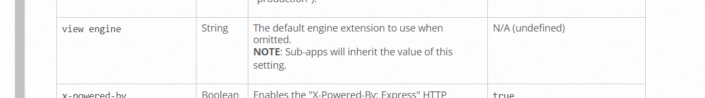
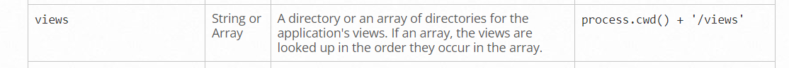

Express.js 
==========
Dont reinvent the wheel.
Express.js is a framework that makes it easy to build web applications. It is built on top of Node.js.

What's in this Module?


npm and packages


What and why?


# Installing Express.js
npm install --save express


Its all about middleware




app listen 
intent to listen to incoming requests
const server = http.createServer(app);
server.listen(3000);




https://expressjs.com/en/5x/api.html#app.use

checkout app.use docs


 npm install --save body-parser

 
 

 

 ```Node.js
 In the next lecture, we'll write this code:

module.exports = path.dirname(process.mainModule.filename);

(I explain why we write this code in the next lecture when we write it!)

The important thing is that you might get a deprecation warning for that code - in that case, you can simply switch to this code:

module.exports = path.dirname(require.main.filename);
Quite straightforward :)
 ```